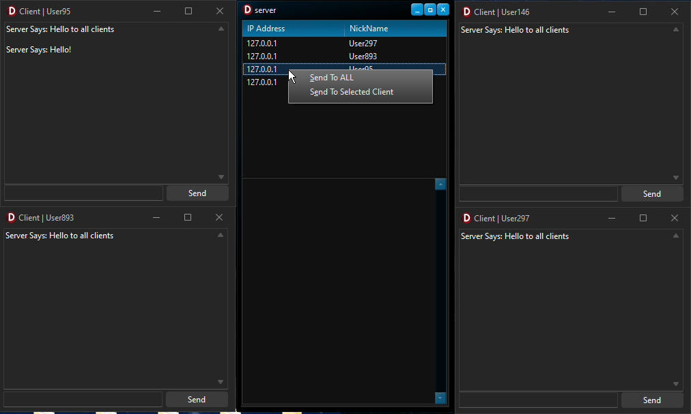

<h1>📡Delphi Server/Client Messaging Application</h1>

This repository features a Server/Client messaging application built in <strong>Delphi</strong>, utilizing the <strong>ICS Overbyte sockets</strong> library. This project enables real-time text communication and demonstrates robust server-client interaction.

  

<h2>📋Projects Overview</h2>
<ul>
  <li><strong>Server Application:</strong> Handles multiple client connections, displays client IP addresses and nicknames in a ListView, and manages both broadcast and private messaging.</li>
  <li><strong>Client Application:</strong> Connects to the server, enabling users to send and receive text string messages.</li>
</ul>

<h2>✨Features</h2>
<ul>
  <li><strong>Multiple Client Connections:</strong> The server can manage connections from multiple clients simultaneously.</li>
  <li><strong>Broadcast Messaging:</strong> Send messages to all connected clients at once.</li>
  <li><strong>Private Messaging:</strong> Select specific clients from the server's ListView to send direct messages.</li>
  <li><strong>Real-Time Updates:</strong> The server dynamically updates the ListView with client details, including IP addresses and nicknames.</li>
</ul>

<h2>⚙️Installation</h2>
<ol>
  <li><strong>Requirements:</strong> Delphi IDE and the ICS Overbyte sockets library.</li>
  <li><strong>Download and Open Project:</strong> Clone this repository and open the .dpr files for the server and client projects in Delphi.</li>
  <li><strong>Compile:</strong> Build both the server and client applications to generate the executables.</li>
  <li><strong>Run:</strong> Start the server application, then connect with the client application.</li>
</ol>

<h2>🔌Usage</h2>
<ol>
  <li><strong>Server Setup:</strong> Start the server, which will listen for incoming connections on the configured port.</li>
  <li><strong>Client Connection:</strong> Enter the server's IP address and port in the client application and connect using a nickname.</li>
  <li><strong>Messaging:</strong> Use the chat interface to send messages:
    <ul>
      <li><strong>Broadcast:</strong> Send messages to all clients connected to the server.</li>
      <li><strong>Private Messaging:</strong> Select a client from the server’s ListView and send a direct message.</li>
    </ul>
  </li>
  <li><strong>Disconnection:</strong> Clients can disconnect gracefully using the disconnect button.</li>
</ol>

<h2>🤝Contributing</h2>

Contributions are welcome! Fork this repository, make improvements, and submit a pull request with your changes.

<h2>📜License</h2>

This project is open-source and distributed under the MIT License. Use at your own discretion and risk.

<h2>📧Contact</h2>

For questions or feedback, reach out via email or open an issue in this repository.

Built with ❤️ By BitmasterXor using Delphi and ICS Overbyte Sockets

